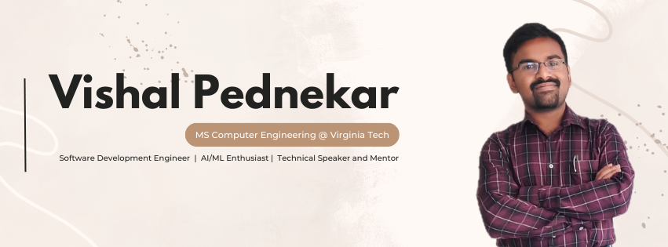

<!--  -->

# Hi there 👋 I'm Vishal Pednekar

---

🎓 MS in Computer Engineering @ Virginia Tech (Class of 2026)  
💡 Full Stack Developer | AI/ML Enthusiast | Systems & Security  
📍 Based in Blacksburg, VA 🇺🇸 | From Mumbai, India 🇮🇳  

---

### 🧠 Skills & Technologies

**Languages:**  
     

**Frameworks & Tools:**  
     

**AI/ML & Data:**  
    

**Cloud & Databases:**  
     

---

### 🔭 I’m currently working on
I’m currently working on something exciting at the intersection of LLMs and real-world applications.

### 🌱 I’m currently learning
Computer Vision and Large Language Models (LLMs), focusing on their integration to build practical, real-world solutions.

### 👯 I’m looking to collaborate on
AI/ML-based research projects, full-stack web/mobile apps, and real-time data analytics systems.

### 🤔 I’m looking for help with
Deploying scalable, containerized microservices with CI/CD pipelines in production.

### 💬 Ask me about
Flutter, Laravel, AI/ML applications, cloud hosting, or building MVPs fast!

### 📫 How to reach me
📧 pednekar.vishal@yahoo.com  
🔗 [LinkedIn](https://www.linkedin.com/in/vishalpednekar)  
📹 [YouTube Channel – The Forgotten Programmer](https://www.youtube.com/@theforgottenprogrammer7842)

### 😄 Pronouns
He/Him

### ⚡ Fun fact
In high school, I coded a game in Python... just to beat boredom during power cuts!

---

